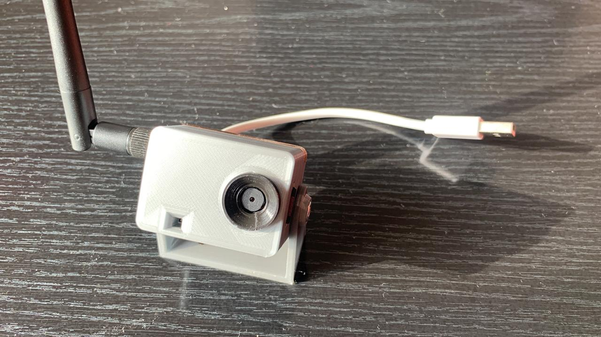
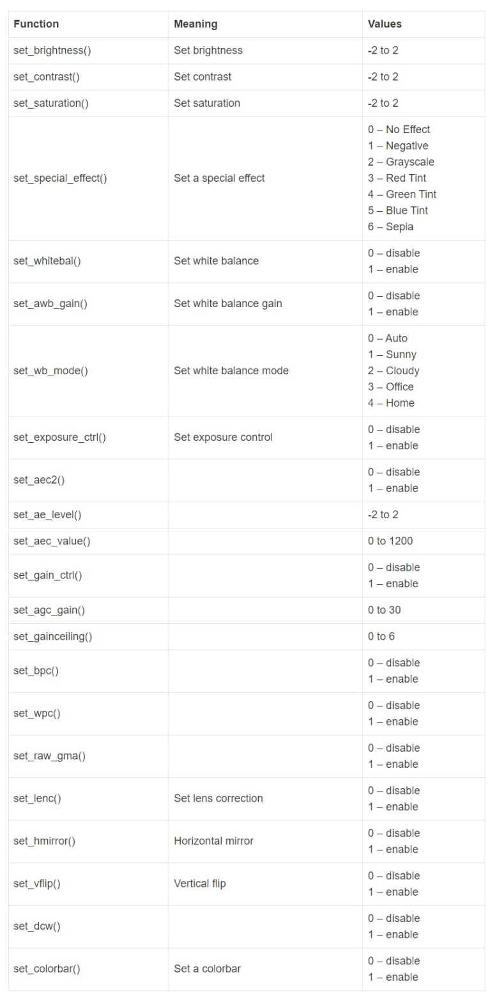
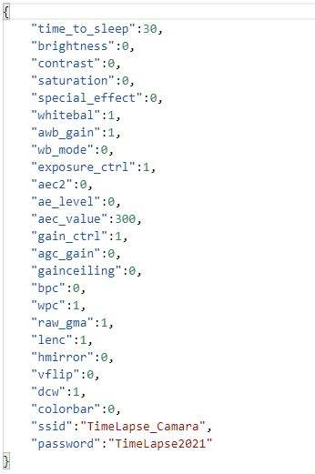

# CAMARA TIMELAPSE CON GESTION WIFI

# Primeros pasos:

Antes de empezar deberemos bajar el proyecto a nuestra PC. Hay en él dos carpetas: una llamada CODIGO y otra llamada CHASIS. En Código esta el programa que deberemos cargar a nuestra ESP32-CAM y en chasis los modelos STL para imprimir la carcaza. 

# Elementos a utilizar

- ESP32-CAM modelo AI_THINKER (El código sirve para cualquier camara pero el chasis solo para esa)
- Antena con pigtail con conector micro para ESP32-CAM (Si se pone la antena externa de deberá cambiar de posición la resistencia interna. Ver más aca: https://randomnerdtutorials.com/esp32-cam-connect-external-antenna/)
- Tornillo rosca métrica de 1/8, 5cm con tuerca
- Cable rojo y negro 
- Conector USB
- Cargador USB de 2,5A
- MicroSD de 32GB formateada en FAT32

# Impresion del chasis

- Es importante imprimir el chasis con una altura de capa de 0,16mm máximo ya que mas allá de este punto puede que la placa no entre o queden las piezas fuera de lugar.
- La velocidad de impresión recomendada es de 40mm/2 máximo para obtener buena terminación.
- No se requieren soportes.
- El parasol si se hace de un PLA con un coeficiente de fusion distinto al del chasis puede que cueste que entre ya que la rosca es muy chica. (ISO 17mm con paso de 0,75mm 3 3 espiras)

# Como cargar el código en la ESP32-CAM

Para copiar el código a la ESP32-Cam se requiere de un adaptador USB-TTL el cual ira conectado de la siguiente manera:

La configuración del entorno arduino para la carga sera:

Nota: Si hay problemas para subir el código a la placa y todo parase corresponder correctamente deberá probar invirtiendo el RX y el TX de la placa TTL.

# Configuración en tiempo de ejecución 

Una vez que el código este compilado y cargado a la ESP32, podremos configurar los parámetros de la camara usando un archivo “JSON” de nombre “config.json”. Desde este podremos cambiar los ajustes de imagen según la siguiente tabla: 

Como asi también los valores del SSID que tendrá el AP WiFi y el tiempo entre cuadros quedando de esta forma:

Nota: Si bien en el proyecto dejo un archivo “config.json” el cual se deberá pegar en el raíz de la MicroSD, esto no es un paso indispensable ya que si dicho archivo no se encuentra se aplicara una configuración por defecto.

# Modo de uso

Una vez energizada la placa usando los cables y el conector USB solicitados en el apartado “Elementos a utilizar”, la placa iniciara con un destello en el LED del flash obteniendo el primer frame e indicando que todo esta OK. Pasado este punto y si se deja la configuración por defecto podremos conectáramos a la camara como si esta fuera un Router WiFi buscando la red “TimeLapse_Camara” y usando la clave “TimeLapse2021”.
Una vez conectados podremos abrir nuestro navegador de internet e ir a la pagina http://192.168.4.1 la cual nos abrirá una interfaz muy discreta en la cual veremos el tiempo entre frames, si la camara opera bien, cuantos frames tenemos en memoria y nos dará la posibilidad de acceder al FTP para descargar los archivos como asi también borrar la SD.

# Haciendo un video TimeLapse

La camara nos obtendra X cantidad de forogramas, cada uno de ellos corresponde a 1/30 segundos de video por lo cual 1 segundo implicara 30 cuadro. Con todo esto iremos a algun programa de video gratuito como https://www.virtualdub.org/ o pago como el Adobe Premier, importaremos los fotogramas y exportaremos el video terminado en formato que querramos: AVI, MP4, MOV, OGG, etc.

# Contactanos en:
https://www.linkedin.com/company/35599193/admin/

# Seguime en:
https://www.linkedin.com/in/fernando-p-maniglia/

# Conocenos más en:
https://www.seamansrl.com.ar
