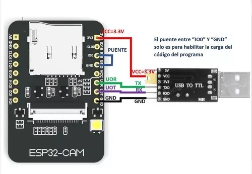

# CAMARA TIME LAPSE CON WIFI

# Primeros pasos:

Antes de empezar deberemos bajar el proyecto a nuestra PC. Hay en el dos carpetas una llamada CODIGO y otra llamada CHASIS. En Código esta el programa que deberemos cargar a nuestra ESP32-CAM y en chasis los modelos STL para imprimir la carcaza. 

# Elementos a utilizar

- ESP32-CAM modelo AI_THINKER (El código sirve para cualquier camara pero el chasis solo para esa)
- Antena con pigtail con conector micro para ESP32-CAM (Si se pone la antena externa de deberá cambiar de posición la resistencia interna. Ver más aca: https://randomnerdtutorials.com/esp32-cam-connect-external-antenna/)
- Tornillo rosca métrica de 1/8, 5cm con tuerca
- Cable rojo y negro 
- Conector USB
- Cargador USB de 2,5A

# Impresion del chasis

- Es importante imprimir el chasis con una altura de capa de 0,16mm máximo ya que mas allá de este punto puede que la placa no entre o queden las piezas fuera de lugar.
- La velocidad de impresión recomendada es de 40mm/2 máximo para obtener buena terminación.
- No se requieren soportes.
- El parasol si se hace de un PLA con un coeficiente de fusion distinto al del chasis puede que cueste que entre ya que la rosca es muy chica. (ISO 17mm con paso de 0,75mm 3 3 espiras)

# Como cargar el código en la ESP32-CAM

Para copiar el código a la ESP32-Cam se requiere de un adaptador USB-TTL el cual ira conectado de la siguiente manera:

La configuración del entorno arduino para la carga sera:

Nota: Si hay problemas para subir el código a la placa y todo parase corresponder correctamente deberá probar invirtiendo el RX y el TX de la placa TTL.

